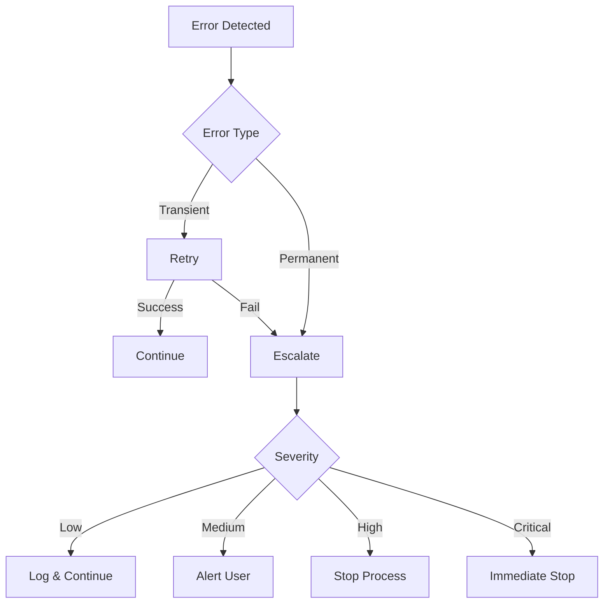

# ErrorHandlingConventions

## Purpose & Scope
This document defines standardized error handling patterns for all agents in the eSource development workflow. It ensures consistent error detection, reporting, recovery, and escalation across the entire system, providing a unified approach to managing failures and maintaining system reliability.

---

## Core Principles

### Fundamental Rules
- **Fail Fast**: Detect and report errors as early as possible
- **Be Specific**: Provide detailed error messages with actionable context
- **Log Everything**: Document all error handling attempts and resolutions
- **Clean Recovery**: Always clean up resources on failure
- **User-Friendly**: Translate technical errors to actionable messages
- **Prevent Cascades**: Isolate errors to prevent chain failures
- **Learn from Errors**: Update patterns based on common failures

### Error Philosophy
- Errors are learning opportunities
- Recovery is preferred over failure
- Transparency in error reporting
- Graceful degradation when possible
- Always maintain system integrity

---

## Implementation Guidelines

### Error Categories

#### 1. ValidationError
- **Description**: Invalid or missing input data
- **Examples**: Missing requirement files, invalid format, incomplete data
- **Recovery**: Request correction from user or previous agent
- **Status**: Failed
- **Severity**: Usually Low to Medium

#### 2. DependencyError
- **Description**: Required resources or files not available
- **Examples**: Missing DesignProfile.md, STATUS.md not found, prerequisite steps incomplete
- **Recovery**: Create missing resource or wait for dependency
- **Status**: Blocked
- **Severity**: Medium to High

#### 3. ConfigurationError
- **Description**: System or environment configuration issues
- **Examples**: Wrong file paths, missing environment variables, incorrect permissions
- **Recovery**: Manual intervention required
- **Status**: Failed
- **Severity**: High

#### 4. ExecutionError
- **Description**: Runtime errors during task execution
- **Examples**: Compilation errors, test failures, API errors
- **Recovery**: Retry with fixes or alternative approach
- **Status**: Retry or Failed
- **Severity**: Varies

#### 5. StateError
- **Description**: Inconsistent or invalid state
- **Examples**: Conflicting status, race conditions, corrupted data
- **Recovery**: Reset state or manual resolution
- **Status**: Blocked
- **Severity**: High to Critical

### Error Recovery Strategies

#### Retry Strategy
```markdown
- Max Attempts: 3
- Backoff: Exponential (1s, 2s, 4s)
- Applicable for: ExecutionError, temporary failures
- Log each attempt in STATUS.md
```

#### Fallback Strategy
```markdown
- Use alternative approach
- Degrade gracefully
- Document limitations
- Continue with reduced functionality
```

#### Manual Intervention
```markdown
- Stop processing
- Log detailed error context
- Request user action
- Wait for resolution
```

#### Skip Strategy
```markdown
- Mark as "Skipped" in STATUS.md
- Document reason
- Continue with next task
- Report impact on deliverables
```

### Error Escalation Path



---

## Standards & Specifications

### Error Reporting Format

#### STATUS.md Error Log Entry
```markdown
## Error Log
### ERR-[EPIC-ID]-[YYYYMMDD]-[SEQUENCE]
- Timestamp: YYYY-MM-DD HH:MM:SS
- Agent: [agent_name]
- Component: [US-ID/Step_ID]
- ErrorType: [ValidationError|DependencyError|ConfigurationError|ExecutionError|StateError]
- Severity: [Low|Medium|High|Critical]
- Message: "Detailed error description"
- Context: "What was being attempted"
- StackTrace: (if applicable)
- RecoveryStrategy: [Retry|Fallback|Manual|Skip]
- RecoveryAttempts: X/3
- Resolution: [Pending|InProgress|Resolved|Failed|Skipped]
- ResolvedBy: [agent_name|user]
- ResolutionNotes: "How it was resolved"
```

### Logging Standards

#### Log Levels
- **DEBUG**: Detailed diagnostic information
- **INFO**: General informational messages
- **WARNING**: Warning messages for recoverable issues
- **ERROR**: Error messages for failures
- **CRITICAL**: Critical failures requiring immediate attention

#### Log Entry Format
```
[TIMESTAMP] [LEVEL] [AGENT] [COMPONENT]: Message
```

---

## Best Practices

### Agent-Specific Error Handling

#### Planning Agents
- Validate all inputs before processing
- Check file existence and format
- Verify prerequisites completed
- Graceful handling of incomplete requirements
- Always update STATUS.md on error

#### Development Agents
- Implement try-catch for all operations
- Run validation before implementation
- Test after each change
- Rollback on critical failures
- Document workarounds

#### Testing Agents
- Continue on non-critical test failures
- Collect all errors before stopping
- Categorize failures by severity
- Generate error report
- Suggest fixes

#### Documentation Agents
- Skip missing components
- Document what couldn't be documented
- Continue with available information
- Flag incomplete sections

### Error Prevention
- Input validation at boundaries
- Defensive programming practices
- Regular state consistency checks
- Resource availability verification
- Timeout handling for long operations

---

## Quality Assurance

### Error Metrics to Track
- Total errors per agent
- Error frequency by type
- Recovery success rate
- Mean time to resolution
- Most common error patterns
- Agent reliability score

### Implementation Checklist
- [ ] Add Error Handling section to agent
- [ ] Implement try-catch blocks in all operations
- [ ] Add STATUS.md error logging capability
- [ ] Define recovery strategies for each error type
- [ ] Test error scenarios thoroughly
- [ ] Document common error patterns
- [ ] Update agent description with error handling

### Validation Criteria
- All operations wrapped in error handling
- Error messages provide actionable information
- Recovery strategies defined and documented
- Error logs follow standard format
- Metrics tracked and reported

---

## Examples

### Try-Catch Implementation
```csharp
try
{
    await ProcessUserStoryAsync(userStory);
    LogInfo($"Successfully processed {userStory.Id}");
}
catch (ValidationError ex)
{
    LogError($"Validation failed for {userStory.Id}: {ex.Message}");
    await RequestCorrectionAsync(userStory, ex);
}
catch (DependencyError ex)
{
    LogWarning($"Dependency missing for {userStory.Id}: {ex.Message}");
    await WaitForDependencyAsync(ex.DependencyName);
}
catch (Exception ex)
{
    LogCritical($"Unexpected error processing {userStory.Id}", ex);
    await NotifyUserAsync(ex);
    throw;
}
finally
{
    await CleanupResourcesAsync();
}
```

### Error Recovery Example
```csharp
public async Task<bool> ExecuteWithRetryAsync(Func<Task> action, int maxAttempts = 3)
{
    for (int attempt = 1; attempt <= maxAttempts; attempt++)
    {
        try
        {
            await action();
            return true;
        }
        catch (ExecutionError ex) when (attempt < maxAttempts)
        {
            var delay = TimeSpan.FromSeconds(Math.Pow(2, attempt - 1));
            LogWarning($"Attempt {attempt} failed, retrying in {delay.TotalSeconds}s");
            await Task.Delay(delay);
        }
    }
    return false;
}
```

### STATUS.md Error Entry Example
```markdown
## Error Log
### ERR-EPIC-027-20240115-001
- Timestamp: 2024-01-15 14:32:18
- Agent: development_basic_implementation
- Component: US-133/Step_03
- ErrorType: ExecutionError
- Severity: Medium
- Message: "Build failed due to missing reference to ViewMode enum"
- Context: "Implementing toggle functionality for tender overview"
- StackTrace: at TenderViewService.cs:45
- RecoveryStrategy: Retry
- RecoveryAttempts: 1/3
- Resolution: Resolved
- ResolvedBy: development_basic_implementation
- ResolutionNotes: "Added missing using statement for CoreBusinessEnum namespace"
```

---

## Notes & Exceptions

### Special Considerations
- Critical errors in production require immediate escalation
- Security-related errors should never expose sensitive information
- Performance degradation errors may require gradual recovery
- Concurrent error handling must prevent race conditions
- Error aggregation for batch operations

### Framework-Specific Notes
- .NET exceptions follow standard hierarchy
- Blazor component errors handled by ErrorBoundary
- Entity Framework errors require transaction rollback
- SignalR connection errors need reconnection logic

---

End of ErrorHandlingConventions